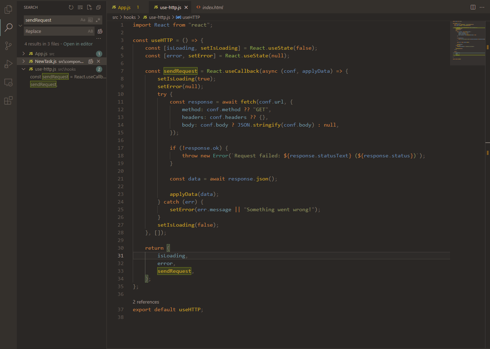

# Korbit theme for [Visual Studio Code](https://code.visualstudio.com/)

Korbit is a minimalist theme for [Visual Studio Code](https://code.visualstudio.com/), inspired by [Gruvbox](https://marketplace.visualstudio.com/items?itemName=tomphilbin.gruvbox-themes), [IntelliJ IDEA Darcula](https://www.jetbrains.com/idea/), and [Visual Studio Dark](https://visualstudio.microsoft.com/) themes.

### Supported languages

Currently only JavaScript, JSX, CSS, and HTML are supported. Other languages may work but not fully. Later updates will implement other languages

## Installation

-   Navigate to the [Korbit Theme](https://marketplace.visualstudio.com/items?itemName=RATIU5DEV.korbit-theme) on the Visual Studio Code Marketplace
-   Select Install
-   Continue with the instructions shown

## Changelog

See [CHANGELOG.md](./CHANGELOG.md)

## License

[MIT License](./LICENSE)
